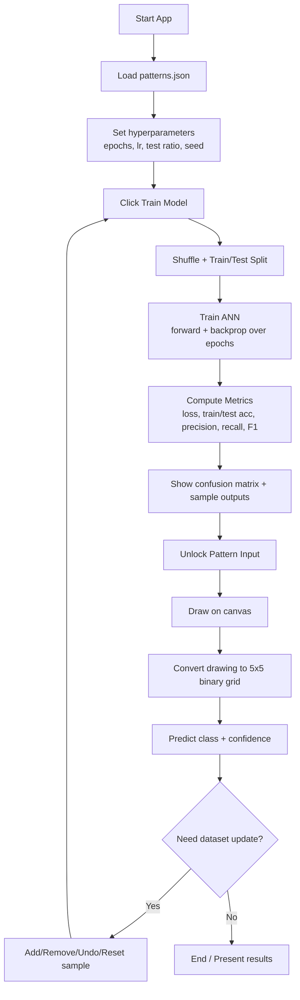
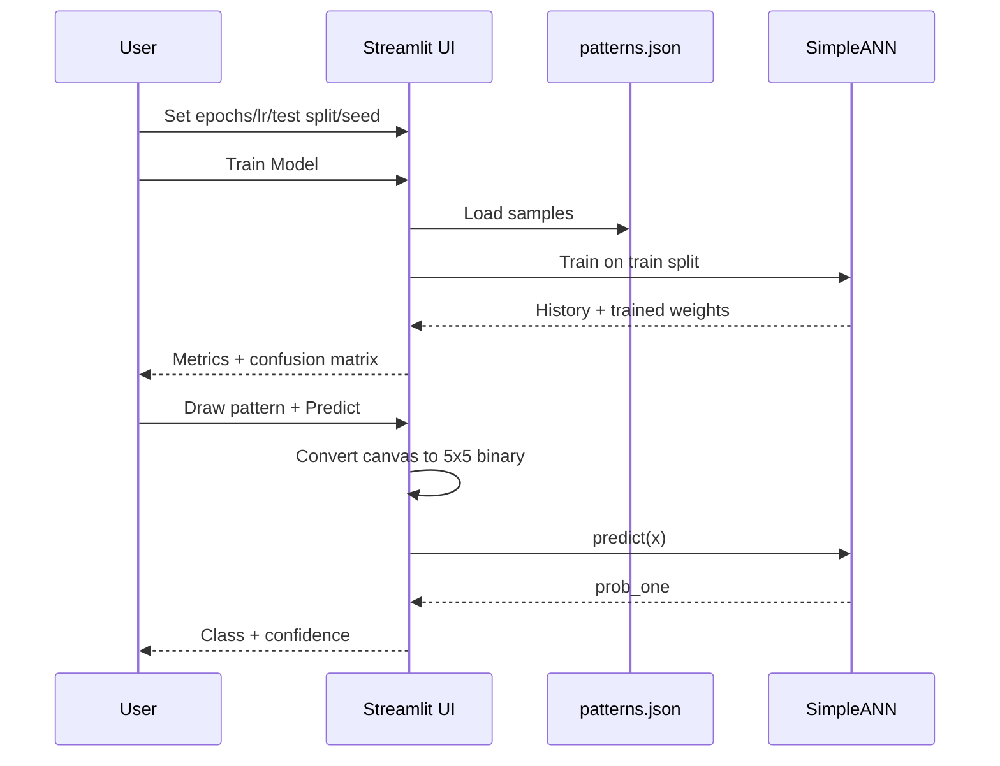

# Architecture and Workflow Diagrams (Code)

Use these Mermaid blocks in Markdown viewers that support Mermaid (or in tools like mermaid.live).

## 1) Architecture Diagram Code

```mermaid
flowchart LR
    A[patterns.json<br/>5x5 binary samples + labels] --> B[Data Loader<br/>build_dataset()]
    B --> C[Preprocessing<br/>flatten 5x5 to 25 features]
    C --> D[SimpleANN Model]

    subgraph D[SimpleANN: 25-5-1]
        D1[Input Layer<br/>25 neurons]
        D2[Hidden Layer<br/>5 neurons + sigmoid]
        D3[Output Layer<br/>1 neuron + sigmoid]
        D1 --> D2 --> D3
    end

    D --> E[Training Loop<br/>forward -> MSE -> backprop -> update]
    E --> F[Metrics<br/>Accuracy, Precision, Recall, F1, Confusion Matrix]
    D --> G[Prediction API<br/>predict()]

    H[Streamlit UI] --> I[Canvas Drawing]
    I --> J[Canvas-to-Grid<br/>grayscale -> 5x5 -> binary]
    J --> G
    G --> K[Prediction Panel<br/>class + confidence]

    H --> L[Dataset Management<br/>add/remove/reset]
    L --> A
```

## 2) Workflow Diagram Code (Step-by-Step)



## 3) Optional Sequence Diagram Code


